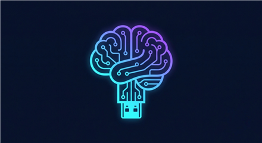

<div align="center" markdown="1">



# PortaBrain

**A portable brain you can plug into any machine.**


[](https://github.com/soullessmonarc/portabrain/actions/workflows/lint.yml)


[](LICENSE)

</div>

That lint badge covers **static analysis only** - shellcheck, PSScriptAnalyzer and
python syntax. There is no integration test and there cannot usefully be one: this
project attaches a physical disk to WSL2 and reformats it, which no hosted runner can
reproduce. A green tick means the code parses and is free of known bad patterns, not
that the rig works.

> [!WARNING]
> **Read this before running anything.**
>
> - **Built with the help of AI**, under a human's direction and review, and disclosed
>   here plainly rather than left for you to notice. That does not make it more or less
>   trustworthy than code from any other source - it means you should read a script
>   before running it as root or Administrator, the same as you would for anything else.
>   `install.sh` / `install-windows.ps1` can **reformat a physical disk**, and this stack
>   is built to run **uncensored/abliterated models with no content filter**. Do your own
>   due diligence first.
> - **A personal side project, not a product.** Built over an extended period out of
>   curiosity about what was possible, by one unpaid maintainer, for personal use on
>   personal hardware - not commissioned, not a company roadmap item, and not something
>   rushed out in a day. See [`docs/PRODUCTION_READINESS.md`](docs/PRODUCTION_READINESS.md)
>   for an itemised, honest account of what has and hasn't actually been verified.
> - **Not intended for business or commercial use.** This repo's [`LICENSE`](LICENSE)
>   (MIT) does not - and legally cannot - forbid that, but that was never the intent
>   behind sharing this, and nothing here comes with a support commitment. Weigh that
>   before depending on it for anything that matters financially. This also isn't only
>   this project's own preference: read [`NOTICE.md`](NOTICE.md) before using anything
>   this stack generates for more than personal curiosity. It also carries a note
>   worth knowing regardless: an earlier version of this project offered
>   **Pony Diffusion V6 XL**, whose license **explicitly prohibits monetized
>   inference** - if you ran an earlier version of this installer and already
>   downloaded it, that restriction still applies to anything generated with it.

> [!IMPORTANT]
> **What is verified on real hardware:** the full install → connect → disconnect
> lifecycle on a blank SSD in a fresh WSL distro, including a real-hardware LUKS
> encryption format/unlock/lock cycle; a reconnect reusing what is already on the drive
> rather than re-downloading it; ComfyUI running; image generation producing a real
> render through Open WebUI's own config path; and video generation producing an actual
> clip, not just the button installing.
>
> **What is not:** portability itself. Everything was proven on *one* machine - moving
> the drive to a different machine, which is the entire point, is still untested. See
> [`docs/PRODUCTION_READINESS.md`](docs/PRODUCTION_READINESS.md) for the itemised
> breakdown.

A self-contained Ollama + ComfyUI + Open WebUI stack that lives entirely on one
external drive, so you can build it once and move it between machines. Nothing in here
is tied to a specific device, drive, or network - every choice is asked interactively
or auto-detected from the hardware in front of it.

- **New here?** → [`docs/EXECUTIVE_SUMMARY.md`](docs/EXECUTIVE_SUMMARY.md)
- **Setting it up?** → [`docs/MASTER_SETUP.md`](docs/MASTER_SETUP.md)
- **How close to production?** → [`docs/PRODUCTION_READINESS.md`](docs/PRODUCTION_READINESS.md)
- **Want the detailed engineering record?** → [`docs/STATUS.md`](docs/STATUS.md)
- **How does the network-share reliability work?** → [`docs/NETWORK_SHARE_RELIABILITY.md`](docs/NETWORK_SHARE_RELIABILITY.md)
- **What are you actually agreeing to by downloading the models?** → [`NOTICE.md`](NOTICE.md)

## Components

| Path | What it is |
|------|-----------|
| `install.sh` | Linux/WSL2 installer: drive picker, format confirmation, optional SMB share, Docker + NVIDIA Container Toolkit install, GPU-tiered model selection. Also the platform picker - hands off to `install-macos-arm.sh` if you choose macOS. |
| `install-windows.ps1` | Windows entry point: elevated disk picker, offers to install WSL2 and the Ubuntu distro itself if missing, attaches the chosen disk to WSL2, hands off to `install.sh`. Run once per machine. |
| `connect.ps1` / `connect.sh` | Bring the rig **back up** — after a reboot, or on a machine already set up once. Attaches and mounts the drive, starts the daemons in the right order, brings the stack up, holds the WSL2 instance open. Asks nothing, installs nothing, needs no network. |
| `disconnect.ps1` / `eject.sh` | Clean shutdown before unplugging: stops the stack, stops the daemons whose data-root is on the drive, unmounts, releases the raw disk from WSL2. |
| `autoconnect-task.ps1` | Restart survival. Registers a Windows Task Scheduler task that runs `connect.ps1` at logon, so a reboot doesn't leave the rig down. Added by the installer and by `connect.ps1`, removed by `disconnect.ps1`. |
| `setup_image_config.py` | Points Open WebUI's image generation at this stack's own ComfyUI container instead of its out-of-the-box default (an unconfigured OpenAI endpoint, which fails immediately). Sets the engine, model, and the workflow/node mapping - verified against Open WebUI's own source, not guessed. |
| `setup_tune_config.py` | Applies the image/video generation defaults chosen from this machine's VRAM to Open WebUI - resolution is 1024×1024 (SDXL's native size) on both GPU tiers, with steps at 40 on a big card and 25 on a small one. |
| `setup_register_models.py` | Registers the chat/coder models in Open WebUI under your chosen name, with the system prompt and image-generation capability wired up. Picks up an optional `system_prompt.txt` (gitignored - not shipped) if you drop one next to these scripts, so a personalised rig can carry its own personality without forking this file. |
| `video_gen_action.py` | Open WebUI Action: a "Generate Video (LTX)" button under each reply, driving ComfyUI's LTX-Video pipeline. Animates a just-generated or attached image if there is one, otherwise generates from the reply text. |
| `setup_video_action.py` | Installs and activates that Action, and keeps it up to date on re-runs. |
| `install-macos-arm.sh` | macOS Apple Silicon entry point: Ollama + Open WebUI via Docker Desktop, SMB share via the macOS Keychain, launchd-based heartbeat/sync. External-drive-only picker (an internal disk is refused outright), with a second path to format one from scratch as APFS if it isn't already in a format macOS can write to. |
| `mac-eject.sh` | macOS clean shutdown: stops only this rig's own containers (read by name from its `docker-compose.yml`, never a guess), then `diskutil eject`s the volume. Finds the rig by searching external volumes rather than needing a path typed in. |
| `share-watcher.ps1` | Windows-only: one-shot check that fires a native toast when the configured network share drops or reconnects mid-session. |
| `install-share-watcher.ps1` | Registers `share-watcher.ps1` as a Windows Scheduled Task (every 2 minutes, while logged in). |
| `docs/` | Setup guide, status record, production-readiness breakdown, and the network-share reliability design doc. |

## Quick start

**First time on a machine** — installs WSL2/Docker and sets up the drive:

```powershell
# Windows: elevated PowerShell, from this folder
powershell -NoProfile -ExecutionPolicy Bypass -File .\install-windows.ps1
```

```bash
# Native Linux
sudo bash install.sh
```

**Every time after that** — bring it up, and shut it down before unplugging:

```powershell
powershell -NoProfile -ExecutionPolicy Bypass -File .\connect.ps1
powershell -NoProfile -ExecutionPolicy Bypass -File .\disconnect.ps1
```

> [!IMPORTANT]
> The `-ExecutionPolicy Bypass` is not decoration. Windows desktop editions ship with
> a `Restricted` policy that refuses to run any `.ps1` at all, so `.\install-windows.ps1`
> on its own fails on a stock machine with "running scripts is disabled on this system".
> Invoking it this way affects only that one process - it changes nothing on your system.
> If you would rather relax it permanently, `Set-ExecutionPolicy -Scope CurrentUser
> RemoteSigned` is the usual choice, but that is a security setting and it is your call.

The installer registers a scheduled task so the rig comes back up ~45 seconds after you
log on. `disconnect.ps1` removes that task again; `connect.ps1` restores it.

Open `http://localhost:8080` once the stack finishes starting. For macOS Apple Silicon,
or the full walkthrough for either path above, see
[`docs/MASTER_SETUP.md`](docs/MASTER_SETUP.md).

**How long the first install actually takes:** realistically **45 minutes to a bit over
2 hours**, almost entirely download time (container images plus whichever model weights
you choose), and it varies a lot with your internet connection. See
[Setup time](docs/MASTER_SETUP.md#setup-time) for the measured breakdown - every number
there is a real timing from running this installer, not a vendor estimate.

## Encryption

The installer offers to put the drive inside a **LUKS2 container**, with a passphrase you
choose at setup and enter on every connect. Worth understanding why that is offered
rather than a password prompt in the script: Open WebUI stores every chat and prompt in a
plain SQLite file on the drive, so on an unencrypted drive all of it is readable by
anyone who plugs it in. A script-level password would not change that, because the
filesystem can simply be mounted directly.

Encryption costs two things: the rig can no longer come back **unattended** after a
reboot (something has to type the passphrase), and macOS support is lost entirely, since
macOS cannot open LUKS volumes. There is also no recovery if you forget the passphrase -
models can be re-downloaded, chats and generated output cannot. Unencrypted drives stay
fully supported. See [`SECURITY.md`](SECURITY.md).

## Network exposure

Open WebUI is bound to `127.0.0.1:8080` by default - reachable from the host machine
only, not the rest of your network. This project runs uncensored models with no content
filter and is meant to be plugged into different machines, some of which may be on
networks you don't fully trust, so that's the deliberate default rather than Docker's
usual all-interfaces publishing. See [`SECURITY.md`](SECURITY.md#network-exposure) for
how to open it up to your own LAN on purpose if you want to.

## Two hard rules for this repo

**The installer can reformat whatever disk you choose.** It always asks you to pick a
drive by number and requires typing `YES` before anything destructive happens - read
that prompt carefully every time, especially on a machine with more than one disk
attached. The Windows picker refuses your system disk outright and labels removable
drives, but it cannot know which drive you *meant*.

**Run `disconnect.ps1` before you unplug.** The drive holds a mounted ext4 filesystem
with Docker's live data-root on it. Pulling it while the stack is running risks
corrupting the image store - not a theoretical concern, it is how this project's own
development rig got corrupted once already.

> [!NOTE]
> The keep-alive that holds the rig open does not survive a reboot or logout - WSL2
> tears the whole VM instance down, taking the containers and the drive's mount with
> it. That is expected; run `connect.ps1` again afterwards.

---

<sub> PortaBrain · soullessmonarcs · made with the help of AI</sub>
